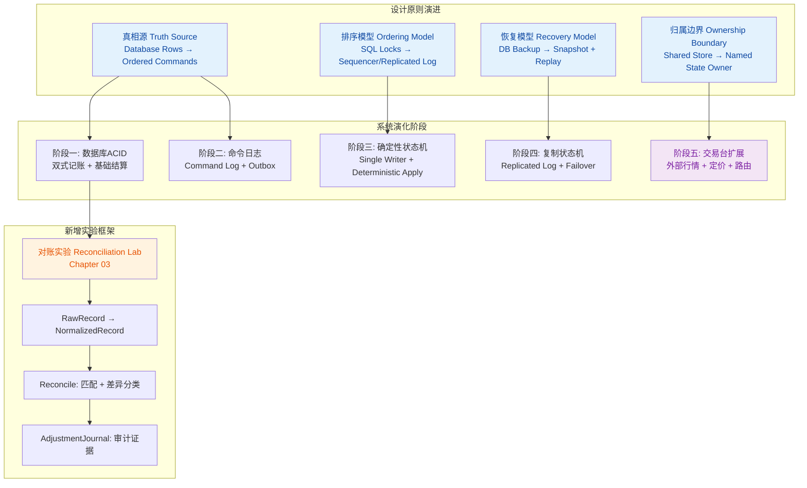
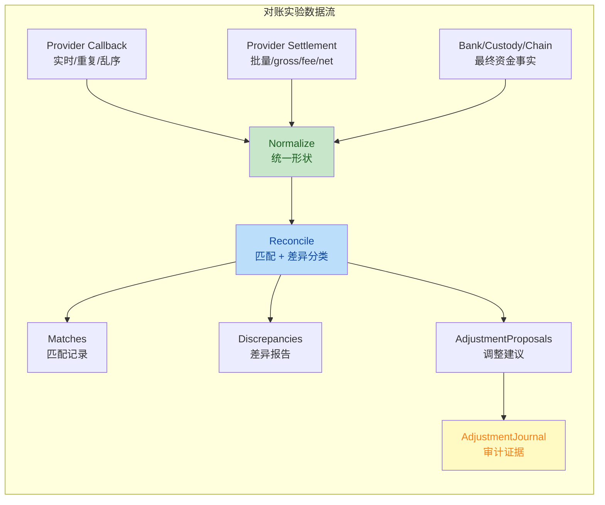
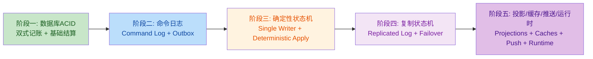

## 1. 高层摘要（TL;DR）

*   **影响范围：** 🔴 **高** - 涉及核心设计文档重构、新增对账实验框架、规划交易台扩展章节
*   **关键变更：**
    *   ✅ 新增完整的**对账实验框架**（第3章），包含类型定义、模拟器和测试用例
    *   📝 重构**设计论文**（docs/10-design-paper.md），系统化阐述四大显式原则
    *   🎯 为各章节添加**状态归属、可靠性、分发规则**等设计原则说明
    *   🚀 规划**阶段五：交易台扩展**（第17-21章），涵盖外部行情、定价引擎、订单路由等

---

## 2. 可视化概览（架构与逻辑图）





---

## 3. 详细变更分析

### 📦 组件一：对账实验框架（第3章）

**变更说明：** 新增完整的对账练习框架，用于练习真实支付场景下的资金对账逻辑。

**新增文件：**
| 文件路径 | 说明 |
|---------|------|
| `chapters/03-wallet-deposit-withdrawal-go/RECONCILIATION_LAB.md` | 实验说明文档（中英双语） |
| `internal/reconciliation/lab.go` | 实验框架代码（TODO方法待实现） |
| `internal/reconciliation/reconciliation_lab_test.go` | 测试用例（带build tag） |
| `internal/reconciliation/types.go` | 类型定义 |

**核心类型定义：**

| 类型 | 用途 |
|------|------|
| `RawRecord` | 不可变的外部/内部原始数据 |
| `NormalizedRecord` | 用于匹配的统一形状 |
| `MatchKind` | 匹配类型（exact/business_id/batch_fee_adjusted等） |
| `DiscrepancyKind` | 差异类型（duplicate/amount_mismatch/timing_difference等） |
| `AdjustmentProposal` | 调整建议 |
| `AdjustmentJournal` | 审计证据记录 |

**实验核心概念：**
- **对账匹配 ≠ 交易撮合**：这里是记录匹配，不是订单簿撮合
- **三类外部输入**：Provider Callback、Provider Settlement Report、Bank/Custody/Chain Records
- **输出是报告**：不自动修改ledger或wallet balance

**运行方式：**
```bash
# 默认测试（保持通过）
go test ./...

# 对账实验测试（预期失败，直到实现）
go test -tags reconciliation_lab_todo ./internal/reconciliation
```

---

### 📦 组件二：设计论文重构（docs/10-design-paper.md）

**变更说明：** 全面重构设计论文，系统化阐述交易所架构演进的四大显式原则。

**新增结构：**

#### 3.1 四大显式原则（The Four Explicit Things）

| 维度 | 早期形式 | 后期形式 | 变化原因 |
|------|---------|---------|---------|
| **真相源** | Database rows | Ordered commands, events, snapshots, projections | 恢复和审计需要事实，不仅是当前行 |
| **排序模型** | SQL locks, MVCC, commit order | Sequencer, single writer, replicated log | 交易正确性依赖可解释的顺序 |
| **恢复模型** | Restore DB backup | Snapshot + replay from known position | 系统必须在故障后重建精确状态 |
| **归属边界** | Shared store queried by many | Named state owner publishes facts | 热状态不应被到处拉取和重新解释 |

#### 3.2 系统演化五阶段



**核心公式：**
```text
old_state + command -> new_state + events
```

#### 3.3 排序机制对比表

| 机制 | 排序代价位置 | 优势 | 成本 |
|------|------------|------|------|
| Pessimistic locking / 2PL | 执行前或执行中 | 共享行的简单正确性 | 争用和死锁 |
| MVCC / CAS / optimistic validation | 提交时 | 高读并发 | 重试和冲突处理 |
| Single writer / sequencer | 变更前 | 简单确定性核心 | 分区和恢复设计 |
| Raft / Paxos / replicated log | 复制执行前 | 故障转移和一致性 | 运营和延迟成本 |

---

### 📦 组件三：章节设计原则强化

#### 3.1 第5章：单写者状态机（Java）

**新增内容：** 状态归属规则

**核心概念：**
- 单写者不只是性能技巧，也是**状态归属边界**
- 热路径 `apply` 函数不应调用数据库、远程服务或共享缓存
- 输入以命令或带版本的本地状态进入，输出以事件离开

**应显式命名的状态：**
- 订单簿状态
- 仓位状态
- 请求去重状态
- 重放游标和最后应用序列
- 热路径维护的最优价或敞口派生视图

#### 3.2 第11章：复制状态机（Aeron Java）

**新增内容：** 可靠性规则

**核心原则：**
```
分发 ≠ 持久 ≠ 可靠
```

**恢复契约必须显式：**
- 每条已提交命令都有有序位置
- 消费者可以检测缺口
- 重启后的服务可以从快照恢复并重放
- 落后的消费者有背压或断开策略
- 故障转移保持同一条外部可见命令历史

#### 3.3 第13章：缓存一致性与市场状态

**新增内容：** 归属规则 + Data Gravity

**归属规则：**
```text
owner 发布 snapshot + versioned deltas
consumer 构建本地投影
```

**测试场景：**
- 账户状态过期必须故障关闭
- 缺失交易规则必须拒绝未知订单
- 标记价格组成出现缺口时，应停止依赖它的风控检查
- 重启后的 consumer 必须能从快照加增量重建

#### 3.4 第14章：市场执行推送

**新增内容：** 分发规则

**分发规则：**
```text
多播或快速 fan-out 分发字节
序列号 + 重放恢复真相
```

**实验场景：**
- 客户端在快照序列之后加入
- 公共增量丢失后重同步
- 私有成交回报乱序到达，直到重放前被拒绝
- 慢消费者被断开或要求重新订阅

#### 3.5 第16章：低延迟运行时与网络

**新增内容：** 运行时 Lab 要求

**性能声明应能被朴素测量：**
- 比较冷启动和 warmup 后的运行
- 报告 p50、p99、p999、max 和标准差
- 统计分配和 GC 事件
- 比较对象重路径、对象池路径和 buffer 导向路径
- 说明内存位于堆内、堆外、direct buffer 还是 native

**关键洞察：**
```
warmup 是系统的一部分，不是 benchmark 脚注
```

---

### 📦 组件四：阶段五规划 - 交易台扩展

**变更说明：** 新增第17-21章规划，定义交易台层作为交易所核心事实的消费者。

| 章节 | 标题 | 原语 | 核心问题 |
|------|------|------|---------|
| 17 | 外部行情摄入 | 消费外部场所订单簿、成交、ticker | 陈旧数据、序列缺口和快照如何影响定价与风控？ |
| 18 | 定价与信号引擎 | 市场状态 → 公允价、标记价格、信号 | 为什么定价应与撮合、路由和风控分离？ |
| 19 | 订单路由与成交回报 | 向外部场所发送子订单并消费成交回报 | 当执行发生在本地订单簿之外时，系统发生了什么变化？ |
| 20 | 对冲器与最优执行 | 在成本、延迟和流动性约束下减少敞口 | 仓位如何变成执行决策？ |
| 21 | 套利策略演示 | 多场所行情 + 路由 mock 展示套利闭环 | 策略需要从行情、定价、风控、路由和对账获得什么？ |

**设计原则：**
```
阶段五不是交易所核心
它建模建立在前面原语之上的交易台、做市或自营交易系统
只有当项目已经拥有可靠的行情流、成交回报、仓位、风险视图和对账边界之后，这一层才自然出现
```

---

### 📦 组件五：路线图文档更新（docs/07-chapter-roadmap.md）

**新增内容：** Lab契约部分

**核心原则：**
```
内存化和低延迟原则应进入已有章节，而不是单独变成一章抽象理论
```

**各章节职责：**
| 章节 | 职责 |
|------|------|
| 第5章 | 命名单写者拥有的私有状态，展示热变更为什么避免共享存储读取 |
| 第11章 | 区分快速分发和可靠恢复：提交顺序、快照、重放和故障转移才是契约 |
| 第13章 | 建模 owner 发布的参考数据和市场状态：快照加版本化增量、缺口检测、重建和失败策略 |
| 第14章 | 把公共行情和私有成交推送建模为可恢复发布，而不是 best-effort 通知 |
| 第16章 | 在声称优化前测量 warmup、分配、对象池、堆外或 buffer 路径以及方差 |

---

## 4. 影响与风险评估

### ⚠️ 破坏性变更

| 变更类型 | 影响 | 缓解措施 |
|---------|------|---------|
| 新增对账实验框架 | 不影响现有测试，使用独立的 build tag | 默认 `go test ./...` 保持通过 |
| 设计论文重构 | 文档结构变化，但内容是增量补充 | 保留原有内容，仅重组结构 |

### ✅ 测试建议

**对账实验测试场景：**
1. ✅ Provider Callback 模拟器生成成功、失败、部分退款、拒付、重复、乱序记录
2. ✅ Provider Report 和 Bank/Chain 记录的规范化
3. ✅ 正常入金的跨 provider report 和 bank payout 匹配
4. ✅ 批量级别 provider charges 对单个 payout 的匹配
5. ✅ 重复、时间差、金额不匹配的分类
6. ✅ 部分退款产生调整建议
7. ✅ 调整日志记录证据但不修改钱包余额

**运行命令：**
```bash
# 验证默认测试不受影响
go test ./...

# 运行对账实验（预期失败，直到实现）
go test -tags reconciliation_lab_todo ./internal/reconciliation
```

### 🎯 学习目标

**对账实验应教会：**
- 外部事件可以重复，内部资金效果只能 apply once
- Provider success、provider settlement、bank/custody finality 是三种不同事实
- Gross、fee、net 必须能闭合
- 时间差不一定是 bug
- 未知差异应该进入 exception workflow
- 人工调整是可审计 journal，不是偷偷改余额

---

## 5. 总结

本次变更是一次**系统性的架构文档升级**，主要贡献包括：

1. **新增对账实验框架**：提供了真实的支付场景对账练习，涵盖重复、乱序、部分退款、批量匹配等复杂情况

2. **系统化设计原则**：通过四大显式原则（真相源、排序模型、恢复模型、归属边界）和五阶段演化，清晰阐述了从数据库ACID到复制状态机的架构演进路径

3. **强化章节设计规则**：为各章节添加了状态归属、可靠性、分发等关键设计原则的说明，使学习路径更加清晰

4. **规划交易台扩展**：定义了第17-21章的范围，明确交易台层作为交易所核心事实的消费者，而非核心本身

这些变更使整个项目从"组件堆砌"转向"语义迁移序列"的架构理念更加清晰，为学习者提供了更系统的思考框架。