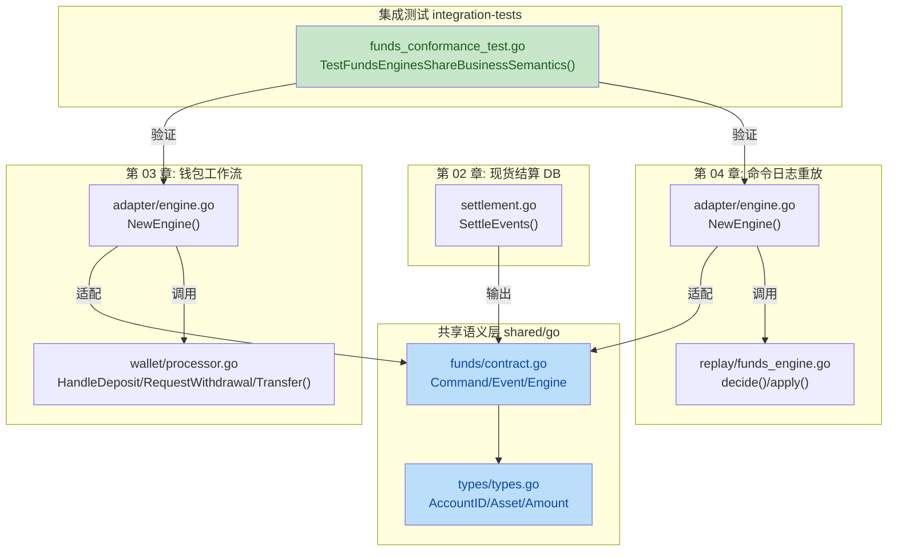

## 1. 高层摘要 (TL;DR)

*   **影响**: **高** - 引入了共享资金语义契约，建立了跨章节一致性测试框架，是项目从"各章节独立实现"转向"语义契约驱动"的关键里程碑。
*   **核心变更**:
    *   📦 新增 `shared/go` 模块，定义统一的资金命令、事件、类型和 Engine 接口
    *   🧪 新增 `integration-tests` 模块，验证不同实现（第 03 章钱包工作流 vs 第 04 章命令日志重放）的外部语义一致性
    *   🔌 第 02、03、04 章通过适配器接入共享契约，第 02 章现货结算输出共享资金事件
    *   📚 大幅更新项目文档，强调"语义契约优先，技术实现可演进"的原则

---

## 2. 可视化概览 (代码与逻辑图)



**架构说明**:
- **共享契约层** (`shared/go`) 定义了资金域的通用语言，所有章节通过适配器实现此契约
- **第 02 章** 将现货结算暴露为共享资金转账事件
- **第 03 章** 直接钱包工作流通过适配器实现 `funds.Engine`
- **第 04 章** 命令日志重放引擎通过适配器实现 `funds.Engine`
- **集成测试** 验证不同实现产生相同的外部可观察行为

---

## 3. 详细变更分析

### 3.1 共享语义层 (`shared/go/`)

**新增文件**:

| 文件 | 描述 |
|------|------|
| `funds/contract.go` | 定义资金命令、事件、拒绝原因和 Engine 接口 |
| `types/types.go` | 定义类型化标识符（AccountID, Asset, Amount 等） |

**核心契约定义** (`shared/go/funds/contract.go`):

```go
// Engine 接口 - 所有实现必须遵循的语义契约
type Engine interface {
    Handle(Command) ([]Event, error)
    Balance(types.AccountID, types.Asset) types.Amount
    Withdrawal(types.WithdrawalID) (Withdrawal, bool)
}
```

**命令类型**:

| 命令类型 | 描述 |
|---------|------|
| `CommandDeposit` | 入金回调 |
| `CommandRequestWithdrawal` | 出金请求 |
| `CommandConfirmWithdrawal` | 出金确认 |
| `CommandTransfer` | 转账 |

**事件类型**:

| 事件类型 | 描述 |
|---------|------|
| `EventDeposited` | 入金成功 |
| `EventWithdrawalRequested` | 出金请求已受理 |
| `EventWithdrawalConfirmed` | 出金已确认 |
| `EventTransferred` | 转账成功 |
| `EventRejected` | 命令被拒绝（含拒绝原因） |

**拒绝原因**:

| 拒绝原因 | 描述 |
|---------|------|
| `RejectInvalidAmount` | 金额无效 |
| `RejectDuplicateCallback` | 重复入金回调 |
| `RejectDuplicateWithdrawal` | 重复出金请求 |
| `RejectDuplicateProviderEvent` | 重复提供商事件 |
| `RejectUnknownWithdrawal` | 未知出金 |
| `RejectInsufficientFunds` | 余额不足 |
| `RejectSequenceGap` | 序列号不连续 |
| `RejectInvalidCommand` | 无效命令 |

---

### 3.2 集成测试 (`integration-tests/`)

**新增文件**: `funds_conformance_test.go`

**测试场景**:

| 场景 | 验证点 |
|------|--------|
| `deposit callback is idempotent` | 重复入金回调只生效一次 |
| `withdrawal cannot overdraft` | 出金不能透支 |
| `withdrawal confirmation is idempotent` | 出金确认重复到达不重复生效 |
| `transfer moves funds with replayable facts` | 转账产生可重放事实并移动余额 |

**测试引擎**:

| 引擎 | 实现方式 |
|------|---------|
| `wallet-workflow` | 第 03 章直接钱包工作流 |
| `command-replay` | 第 04 章命令日志重放引擎 |

**验证内容**:
- 事件序列完全一致
- 最终余额状态一致
- 出金状态一致

---

### 3.3 第 02 章: 现货结算 (`chapters/02-spot-trade-db-go/`)

**变更内容**:

| 文件 | 变更 |
|------|------|
| `go.mod` | 添加 `shared/go` 依赖 |
| `internal/spot/settlement.go` | 引入共享类型，新增 `SettleEvents()` 方法 |
| `internal/spot/settlement_test.go` | 添加事件输出验证测试 |

**类型迁移**:

| 原类型 | 新类型 |
|--------|--------|
| `string` (Ref) | `types.Ref` |
| `string` (AccountID) | `types.AccountID` |
| `string` (Asset) | `types.Asset` |
| `int64` (Amount) | `types.Amount` |
| `string` (BalanceKey) | `types.BalanceKey` |

**新增方法**:

```go
// SettleEvents 将结算暴露为共享资金转账事件
func (s *Store) SettleEvents(trade Trade) ([]funds.Event, error) {
    // ... 验证和结算逻辑 ...
    return []funds.Event{
        {
            Ref:    trade.Ref,
            Kind:   funds.EventTransferred,
            From:   trade.Buyer,
            To:     trade.Seller,
            Asset:  trade.QuoteAsset,
            Amount: trade.QuoteAmount,
        },
        {
            Ref:    trade.Ref,
            Kind:   funds.EventTransferred,
            From:   trade.Seller,
            To:     trade.Buyer,
            Asset:  trade.BaseAsset,
            Amount: trade.BaseAmount,
        },
    }, nil
}
```

---

### 3.4 第 03 章: 钱包工作流 (`chapters/03-wallet-deposit-withdrawal-go/`)

**新增文件**: `adapter/engine.go`

**适配器实现**:

| 方法 | 功能 |
|------|------|
| `NewEngine()` | 创建适配器实例 |
| `Handle(command)` | 处理命令并返回事件 |
| `Balance(accountID, asset)` | 查询余额 |
| `Withdrawal(id)` | 查询出金状态 |

**命令处理映射**:

| 命令类型 | 处理方法 |
|---------|---------|
| `CommandDeposit` | `handleDeposit()` |
| `CommandRequestWithdrawal` | `handleRequestWithdrawal()` |
| `CommandConfirmWithdrawal` | `handleConfirmWithdrawal()` |
| `CommandTransfer` | `handleTransfer()` |

**新增功能** (`internal/wallet/wallet.go`):

```go
// Transfer 转账方法
func (p *Processor) Transfer(from, to, asset string, amount int64) error {
    // 验证参数和余额
    // 执行转账
    return nil
}
```

---

### 3.5 第 04 章: 命令日志重放 (`chapters/04-command-log-replay-go/`)

**新增文件**:
- `adapter/engine.go`: 适配器入口
- `internal/replay/funds_engine.go`: 重放引擎实现

**重放引擎结构**:

```go
type FundsEngine struct {
    lastSeq          types.Seq
    balances         map[types.BalanceKey]types.Amount
    seenCallbacks    map[types.CallbackID]struct{}
    seenProviderEvts map[types.ProviderEventID]struct{}
    withdrawals      map[types.WithdrawalID]funds.Withdrawal
    events           []funds.Event
}
```

**核心方法**:

| 方法 | 功能 |
|------|------|
| `Handle(command)` | 验证序列号，调用 `decide()` 和 `apply()` |
| `decide(command)` | 决定命令是否成功，返回事件 |
| `apply(event)` | 将事件应用到状态 |

**决策-应用分离模式**:

```go
// 决策阶段：纯函数，不修改状态
func (e *FundsEngine) decide(command funds.Command) funds.Event {
    // 根据命令类型和当前状态决定结果
}

// 应用阶段：修改状态
func (e *FundsEngine) apply(event funds.Event) {
    // 根据事件类型更新余额、出金状态等
}
```

---

### 3.6 Go Workspace (`go.work`)

**新增文件**: `go.work`

**工作空间模块**:

| 模块 | 路径 |
|------|------|
| `01-double-entry-ledger-go` | `./chapters/01-double-entry-ledger-go` |
| `02-spot-trade-db-go` | `./chapters/02-spot-trade-db-go` |
| `03-wallet-deposit-withdrawal-go` | `./chapters/03-wallet-deposit-withdrawal-go` |
| `04-command-log-replay-go` | `./chapters/04-command-log-replay-go` |
| `integration-tests` | `./integration-tests` |
| `shared/go` | `./shared/go` |
| `tools/go` | `./tools/go` |

---

### 3.7 构建系统 (`Makefile`)

**变更内容**:

```makefile
test-go:
    cd shared/go && go test ./...        # 新增
    cd chapters/01-double-entry-ledger-go && go test ./...
    cd chapters/02-spot-trade-db-go && go test ./...
    cd chapters/03-wallet-deposit-withdrawal-go && go test ./...
    cd chapters/04-command-log-replay-go && go test ./...
    go test ./integration-tests/...      # 新增
    cd tools/go && go test ./...
```

---

### 3.8 文档更新

| 文档 | 主要变更 |
|------|---------|
| `README.md` | 强调资金语义契约，更新项目结构说明 |
| `docs/01-core-principles.md` | 更新里程碑定义，强调语义契约优先 |
| `docs/07-chapter-roadmap.md` | 说明共享语义层和集成测试的作用 |
| `docs/04-truth-source-migration.md` | 更新代码地图，说明各章节如何接入共享契约 |
| `docs/06-version-contract-and-testing.md` | 说明第一份具体契约（Go 资金契约）的作用 |

**关键原则更新**:

> 业务语义应该保持稳定，技术实现可以持续演进。
> 核心契约应该描述系统能接受什么命令、产生什么事实、暴露什么拒绝原因，而不是绑定到某个数据库、消息队列或运行时。

---

## 4. 影响与风险评估

### 4.1 破坏性变更

| 变更 | 影响 | 缓解措施 |
|------|------|---------|
| 第 02 章类型系统迁移 | 使用 `types.AccountID` 等强类型替代 `string` | 向后兼容，类型转换透明 |
| 新增共享依赖 | 需要配置 Go Workspace | 已提供 `go.work` 文件 |

### 4.2 测试建议

✅ **必须测试的场景**:

1. **集成测试通过**: 运行 `go test ./integration-tests/...` 确保第 03 章和第 04 章产生相同结果
2. **第 02 章事件输出**: 验证 `SettleEvents()` 输出符合共享契约
3. **序列号验证**: 测试序列号不连续时的拒绝行为
4. **幂等性**: 验证重复入金回调、重复出金确认的幂等性
5. **余额不足**: 验证出金和转账时的余额检查

⚠️ **边缘场景**:

- 空账户ID、资产ID、金额为0或负数的验证
- 未知出金ID的确认操作
- 序列号跳跃和重复的处理

---

## 5. 总结

本次变更建立了项目的**第一份共享语义契约**，通过以下方式实现了"架构可变、语义不变"的目标：

1. ✅ **统一语言**: `shared/go` 定义了资金域的通用类型和接口
2. ✅ **适配器模式**: 各章节通过薄适配器接入共享契约，内部实现可自由演进
3. ✅ **一致性验证**: 集成测试证明不同实现产生相同的外部可观察行为
4. ✅ **可扩展性**: 未来可以轻松添加新的实现（如数据库事务、复制状态机）而不改变测试场景

这是项目从"各章节独立实现"转向"语义契约驱动"的关键里程碑，为后续交易域的实现奠定了坚实基础。